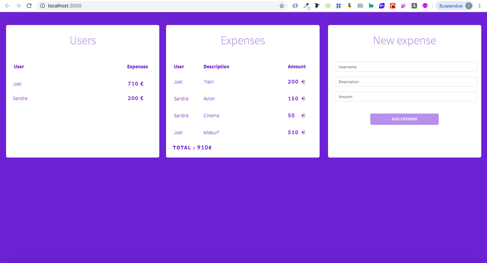

# Expense Report Web App

## Table of contents

  * [General info](#general-info)
  * [Technologies](#technologies)
  * [Installation](#installation)
  * [Features](#features)
  * [Status](#status)

## General info

Project done during training to learn about some basic React.js concepts.

## Technologies

  * axios - version 0.19.0
  * React.js - version 16.9.0
  * react-router-dom - version 5.0.1

## Installation

* Clone the repository

      https://github.com/CamilleGvd/Expense-Report-Front-end.git

* Add dependencies

		npm install

Make sure that nothing is running on your port 3000.

* Run the web app

		npm start

## Features

  * Add a new expense : fill in the form (username, description, amount)
  
  * These informations are displayed in the component "Expenses"
  
  * The total amount per user is displayed in the component "Users"
 
 
 

## Status

Project is in progress.
